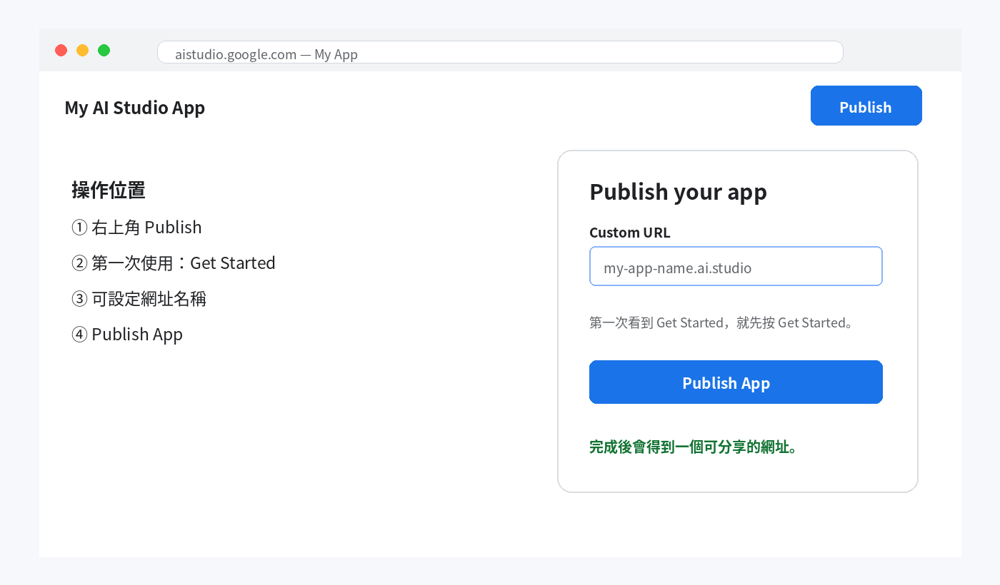
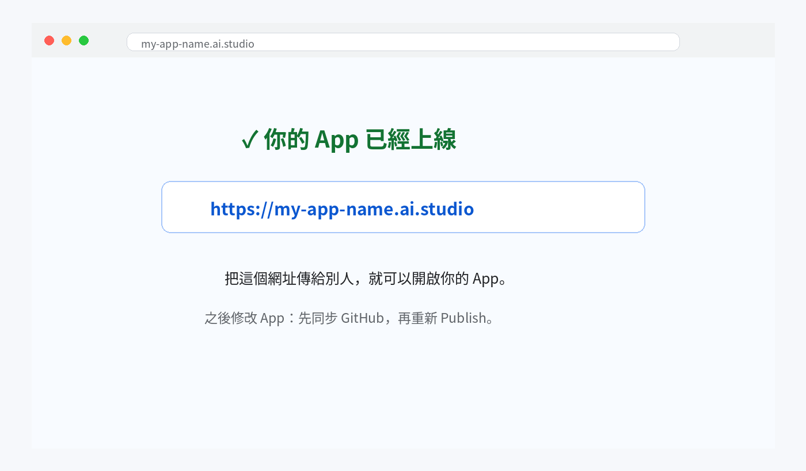

# 先搞懂：GitHub 不是「上線網站」

這個流程只有四件事：

<table>
<colgroup>
<col style="width: 25%" />
<col style="width: 25%" />
<col style="width: 25%" />
<col style="width: 25%" />
</colgroup>
<thead>
<tr class="header">
<th><strong>1 
Google AI Studio 
</strong>做 App</th>
<th><strong>2 
GitHub 
</strong>保存程式碼版本</th>
<th><strong>3 
Publish 
</strong>把 App 放到網路上</th>
<th><strong>4 
網址 
</strong>別人可以直接開</th>
</tr>
</thead>
<tbody>
</tbody>
</table>

| **資安上最重要的觀念：GitHub 建議使用 Private（私人）Repository；API Key、密碼、Token 不要放進 GitHub。** |
|-----------------------------------------------------------------------------------------------------------|

# 開始前，請先確認

> **•** 你已經有一個可以正常預覽的 Google AI Studio「網頁 App」專案。
>
> **•** 你可以登入 Google AI Studio 使用的 Google 帳號。
>
> **•** 準備一個常用 Email，用來註冊 GitHub（如果還沒有 GitHub）。

# 步驟 1｜沒有 GitHub？先建立帳號

前往：[<u>https://github.com/</u>](https://github.com/)

> **•** 按 Sign up / Create account。
>
> **•** 依畫面填 Email、密碼、使用者名稱。
>
> **•** 到信箱完成 Email 驗證。
>
> **•** 建議開啟兩步驟驗證（2FA），避免帳號只靠密碼保護。

操作位置示意：按鈕名稱或位置可能因 Google AI Studio 更新略有不同。

# 步驟 2｜在 Google AI Studio 連動 GitHub，並建立 Private Repository

> **• 回到你的 Google AI Studio App。**
>
> **• 點上方的 GitHub 圖示；如果找不到，也可以打開 Settings（設定）→
> GitHub。**
>
> **• 第一次使用時，按 Connect GitHub，依畫面登入並授權。**
>
> **• Repository name：輸入名稱，例如 my-ai-studio-app；Visibility：選
> Private。**
>
> **• 按 Create Git repo / Create new repository。AI Studio 會建立
> Repository，並把目前 App 程式碼同步到 GitHub。**

操作位置示意：按鈕名稱或位置可能因 Google AI Studio 更新略有不同。

<table>
<colgroup>
<col style="width: 100%" />
</colgroup>
<thead>
<tr class="header">
<th>GitHub 顯示「授權」畫面時，代表你正在允許 Google AI Studio 存取
GitHub。 
如果可以選範圍，建議只授權需要使用的 Repository。</th>
</tr>
</thead>
<tbody>
</tbody>
</table>

**上線前，先請 AI Studio 自己檢查一次**

在 Prompt 輸入：「請檢查目前 App 是否有 build
error；如果有，請直接修正，並確認目前版本可以部署。」

# 步驟 3｜正式上線，取得網址

GitHub 已經保存目前版本。接下來把 App 放到網路上。

> **•** 回到 Google AI Studio App。
>
> **•** 按右上角 Publish。
>
> **•** 第一次使用如果看到 Get Started，先按 Get Started。
>
> **•** Custom URL 可輸入想要的網址名稱；若名稱已被使用，就換一個。
>
> **•** 按 Publish App。

操作位置示意：按鈕名稱或位置可能因 Google AI Studio 更新略有不同。

| 發布時可能會使用 Google Cloud Run，並可能要求選擇 Google Cloud project 或設定計費。是否產生費用，會依實際使用量與帳號方案而定。 |
|---------------------------------------------------------------------------------------------------------------------------------|

# 完成｜你會拿到一個網址

發布完成後，畫面會提供網址。把網址貼到新的瀏覽器分頁確認可以打開。

操作位置示意：按鈕名稱或位置可能因 Google AI Studio 更新略有不同。

<table>
<colgroup>
<col style="width: 100%" />
</colgroup>
<thead>
<tr class="header">
<th><strong>建議最後測試 3 件事： 
1. 手機可以開　2. 無痕模式可以開　3. App
的主要功能可以正常使用</strong></th>
</tr>
</thead>
<tbody>
</tbody>
</table>

# 之後修改 App，要怎麼更新？

最簡單的記法：

<table>
<colgroup>
<col style="width: 33%" />
<col style="width: 33%" />
<col style="width: 33%" />
</colgroup>
<thead>
<tr class="header">
<th>① 
在 AI Studio Prompt 說明要修改什麼</th>
<th>② 
Push changes 到 GitHub</th>
<th>③ 
重新 Publish</th>
</tr>
</thead>
<tbody>
</tbody>
</table>

| **GitHub 的用途是保留「程式碼版本」。它不會自動保存使用者在 App 裡輸入的資料。** |
|----------------------------------------------------------------------------------|

# 如果卡住，先看這裡

| 找不到 GitHub Repository     | 確認 Repository 是你建立的，且 AI Studio 已取得 GitHub 授權。                                    |
|------------------------------|--------------------------------------------------------------------------------------------------|
| Publish 失敗                 | 回到 AI Studio Prompt 輸入：「請修正目前的 build error，並確認可以部署。」修正後再重新 Publish。 |
| 網址打得開，但 AI 功能不能用 | 檢查 Settings → Secrets；不要把 API Key 貼到 GitHub。                                            |
| 修改後網址內容沒變           | 確認已同步最新版本，並重新 Publish。                                                             |

# 最後補充｜這種部署方式要注意什麼？

> **•** GitHub 存的是「程式碼」，不是使用者資料。
>
> **• 如果 App
> 沒有接資料庫，使用者新增或修改的資料，重新整理或重新部署後可能不會保留。**

• 如果需要保存資料，可以在 AI Studio Prompt 說：「請幫這個 App 加上
Firebase Firestore，讓資料可以長期保存。」完成後要再實際測試一次。

> **•** 不要把 API Key、密碼或公司機密直接寫進程式碼；請放在 AI Studio
> 的 Secrets。
>
> **•** 網址公開後，拿到網址的人可能都能使用
> App；如果內容敏感，應另外做登入或權限控管。
>
> **•** AI 功能可能有使用量或費用限制；正式大量使用前，先確認 Google AI
> Studio / Gemini API 的用量與計費設定。

| 簡單記住：GitHub 用來保存程式碼版本；Secrets 用來放金鑰；要保存使用者資料，App 需要資料庫。 |
|---------------------------------------------------------------------------------------------|

## 官方參考

[<u>Google AI Studio — Build
apps</u>](https://ai.google.dev/gemini-api/docs/aistudio-build-mode)

[<u>GitHub — Getting started with your
account</u>](https://docs.github.com/en/get-started/onboarding/getting-started-with-your-github-account)

文件依 2026-08-29 可取得的官方資訊製作。Google AI Studio 與 GitHub
介面可能隨更新略有變動。
