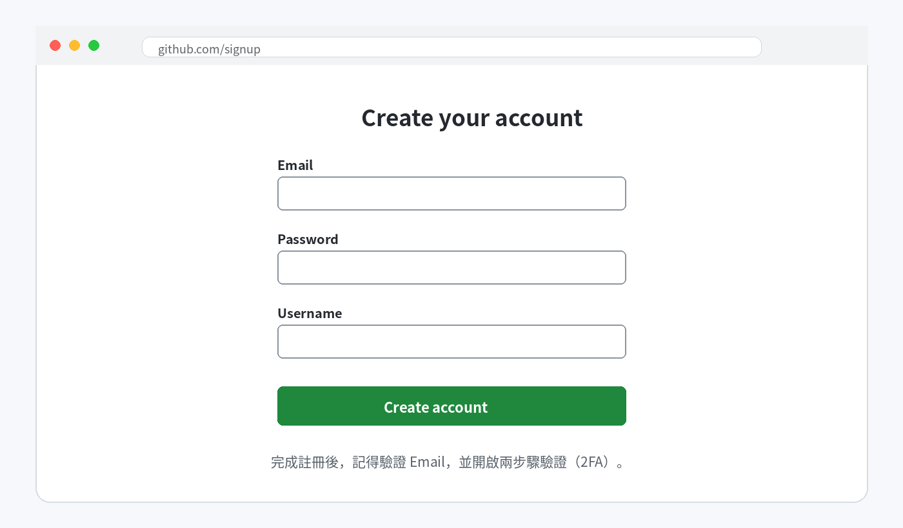
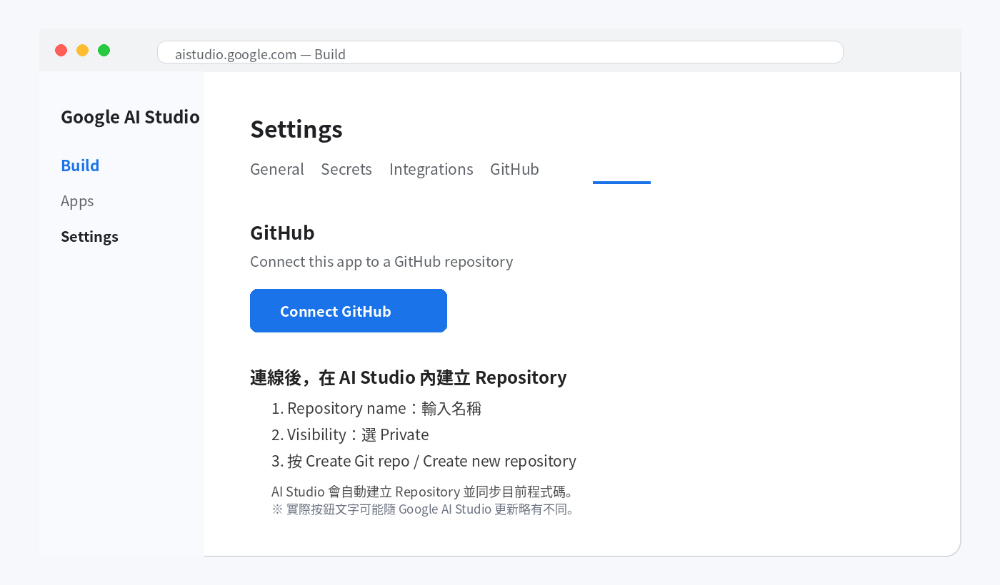

# 如何讓 Google AI Studio APP 在 GitHub 上運行

這個流程只有四件事：

<table>
<colgroup>
<col style="width: 25%" />
<col style="width: 25%" />
<col style="width: 25%" />
<col style="width: 25%" />
</colgroup>
<thead>
<tr class="header">
<th><strong>1 
Google AI Studio 
</strong>做 App</th>
<th><strong>2 
GitHub 
</strong>同步程式碼版本</th>
<th><strong>3 
CI/CD 
</strong>GitHub Actions 自動部署</th>
<th><strong>4 
GitHub Pages 
</strong>每次 Push 自動更新網站</th>
</tr>
</thead>
<tbody>
</tbody>
</table>

| **資安上最重要的觀念：API Key、密碼、Token 不要放進 GitHub，也不能寫進要由 GitHub Pages 公開的前端程式碼。** |
|-------------------------------------------------------------------------------------------------------------------|

# 開始前，請先確認

> **•** 你已經有一個可以正常預覽的 Google AI Studio「網頁 App」專案。
>
> **•** 這個 App 可以建置成靜態網站，不依賴 Node.js 後端、伺服器端 Secrets 或只能在伺服器執行的功能。如果不確定，步驟 3 會先請 AI Studio 檢查。
>
> **•** 你可以登入 Google AI Studio 使用的 Google 帳號。
>
> **•** 準備一個常用 Email，用來註冊 GitHub（如果還沒有 GitHub）。

# 步驟 1｜沒有 GitHub？先建立帳號

前往：[<u>https://github.com/</u>](https://github.com/)

> **•** 按 Sign up / Create account。
>
> **•** 依畫面填 Email、密碼、使用者名稱。
>
> **•** 到信箱完成 Email 驗證。
>
> **•** 建議開啟兩步驟驗證（2FA），避免帳號只靠密碼保護。

操作位置示意：按鈕名稱或位置可能因 Google AI Studio 更新略有不同。

# 步驟 2｜在 Google AI Studio 連動 GitHub，並建立 Repository

> **• 回到你的 Google AI Studio App。**
>
> **• 點上方的 GitHub 圖示；如果找不到，也可以打開 Settings（設定）→
> GitHub。**
>
> **• 第一次使用時，按 Connect GitHub，依畫面登入並授權。**
>
> **• Repository name：輸入名稱，例如 my-ai-studio-app。若使用 GitHub Free 並要公開 GitHub Pages，Visibility 選 Public；Private Repository 是否能使用 Pages，依 GitHub 方案而定。**
>
> **• 按 Create Git repo / Create new repository。AI Studio 會建立
> Repository，並把目前 App 程式碼同步到 GitHub。**

操作位置示意：按鈕名稱或位置可能因 Google AI Studio 更新略有不同。

<table>
<colgroup>
<col style="width: 100%" />
</colgroup>
<thead>
<tr class="header">
<th>GitHub 顯示「授權」畫面時，代表你正在允許 Google AI Studio 存取
GitHub。 
如果可以選範圍，建議只授權需要使用的 Repository。</th>
</tr>
</thead>
<tbody>
</tbody>
</table>

# 步驟 3｜只做一次：請 AI Studio 建立 GitHub Pages CI/CD

回到 Google AI Studio App，在 Prompt 輸入以下完整指示：

> 「請先檢查目前 App 是否適合部署到 GitHub Pages。GitHub Pages 只能提供靜態檔案；如果 App 依賴 Node.js 後端、伺服器端 API、Secrets、資料庫或其他無法在瀏覽器安全執行的功能，請先停止，不要把任何金鑰移到前端，並告訴我不適合的原因。
>
> 如果適合，請依目前專案實際使用的框架與套件管理工具，完成 GitHub Pages 自動部署設定：
>
> 1. 確認正式 build 指令與輸出資料夾，並修正所有 build error。
> 2. 若框架需要，設定正確的 GitHub Pages base path：`/<Repository 名稱>/`。
> 3. 新建 `.github/workflows/deploy-pages.yml`。當程式碼 push 到 `main` 時，workflow 要安裝依賴、執行正式 build、上傳靜態產物，並使用 GitHub 官方 Pages Actions 部署；同時支援 `workflow_dispatch` 手動執行。
> 4. Workflow 只給予必要權限：`contents: read`、`pages: write`、`id-token: write`，部署環境使用 `github-pages`。
> 5. 完成後再次執行 build，確認成功，並列出你新增或修改的檔案。不要把 API Key、密碼或 Token 寫入任何檔案。」

AI Studio 完成後，打開 Code 確認能看到 `.github/workflows/deploy-pages.yml`，再按 GitHub 圖示裡的 **Push changes**（如果介面顯示 **Publish to GitHub**，則使用該按鈕），把這些變更推送到 GitHub 的 `main` branch。

| **`.yml` 必須實際同步到 GitHub 的 `.github/workflows/` 資料夾中；只留在 AI Studio、尚未 Push 到 GitHub 時，不會執行自動部署。** |
|----------------------------------------------------------------------------------------------------------------------------------|

# 步驟 4｜只做一次：在 GitHub 開啟 Pages

前往剛才建立的 GitHub Repository：

> **•** 點 **Settings**。
>
> **•** 左側點 **Pages**。
>
> **•** 在 **Build and deployment → Source** 選擇 **GitHub Actions**。
>
> **•** 回到 **Actions** 頁面，打開剛才觸發的 workflow，等待 build 與 deploy 都顯示綠色勾勾。如果第一次執行發生在 Pages 開啟之前而失敗，請按 **Run workflow** 再執行一次。

這項 Repository 管理設定通常需要 GitHub 管理員操作一次，不能只靠 AI Studio 在專案裡建立 `.yml` 完成。

# 完成｜取得 GitHub Pages 網址

部署成功後，在 **Settings → Pages** 按 **Visit site**。專案網站的網址通常是：

`https://<GitHub 使用者名稱>.github.io/<Repository 名稱>/`

<table>
<colgroup>
<col style="width: 100%" />
</colgroup>
<thead>
<tr class="header">
<th><strong>建議最後測試 3 件事： 
1. 手機可以開　2. 無痕模式可以開　3. App
的主要功能可以正常使用</strong></th>
</tr>
</thead>
<tbody>
</tbody>
</table>

# 之後修改 App，要怎麼自動部署更新？

每次要更新網站時，優先在 Google AI Studio 的 Prompt 輸入：

> 「請依照以下需求修改目前的 App：[在這裡寫要修改的內容]。修改完成後，請檢查是否有 build error；如果有，請直接修正，並確認目前版本可以部署。不要把 API Key、密碼或 Token 寫進程式碼。」

AI Studio 完成修改後，先在右側預覽確認結果，再依照以下流程操作：

<table>
<colgroup>
<col style="width: 33%" />
<col style="width: 33%" />
<col style="width: 34%" />
</colgroup>
<thead>
<tr class="header">
<th>① 
在 AI Studio Prompt 輸入修改需求</th>
<th>② 
確認右側預覽與主要功能</th>
<th>③ 
按 Push changes / Publish to GitHub，把變更推送到 main</th>
</tr>
</thead>
<tbody>
</tbody>
</table>

只要新 commit 成功進入 GitHub 的 `main` branch，GitHub Actions 就會自動執行 build 與部署。等待 Actions 顯示成功後，重新整理原本的 GitHub Pages 網址即可看到新版；CI/CD 與 Pages 不需要重複設定，也不需要再按 AI Studio 用來部署 Cloud Run 的 **Publish App**。

| **簡單記住：AI Studio 負責修改與 Push 程式碼；GitHub Actions 偵測 main 的新 commit；GitHub Pages 自動更新網站。** |
|---------------------------------------------------------------------------------------------------------------------|

| **GitHub 的用途是保留「程式碼版本」。它不會自動保存使用者在 App 裡輸入的資料。** |
|----------------------------------------------------------------------------------|

# 如果卡住，先看這裡

| 找不到 GitHub Repository          | 確認 Repository 是你建立的，且 AI Studio 已取得 GitHub 授權。                                                     |
|-----------------------------------|-------------------------------------------------------------------------------------------------------------------|
| Push 後 Actions 沒有執行          | 確認變更已進入 `main`，且 `.github/workflows/deploy-pages.yml` 已存在於 GitHub。                                  |
| Workflow build 失敗               | 把 Actions 的錯誤訊息貼回 AI Studio Prompt，請它依錯誤修正並再次 Push。                                          |
| Pages 顯示 404 或頁面空白         | 檢查 **Settings → Pages → Source** 是否為 **GitHub Actions**，並請 AI Studio 檢查 base path 與 build 輸出資料夾。 |
| 網站能開，但 AI 功能不能用        | App 可能依賴後端或 Secrets，不適合純 GitHub Pages；不要把 API Key 改放前端，應改用 Cloud Run 或安全後端。         |
| Actions 成功，但內容仍是舊版      | 確認該次 run 對應最新 commit，等待幾分鐘後強制重新整理瀏覽器。                                                    |

# 最後補充｜這種部署方式要注意什麼？

> **•** GitHub Pages 是靜態網站託管，不會執行 AI Studio App 的 Node.js 伺服器端程式。
>
> **•** AI Studio 的 Secrets 不會自動提供給 GitHub Pages。GitHub Actions Secret 也不能安全地變成瀏覽器端 API Key；需要金鑰的功能應透過安全後端呼叫。
>
> **•** 網址公開後，拿到網址的人可能都能使用
> App；如果內容敏感，應另外做登入或權限控管。
>
> **•** 如果 App 需要伺服器、資料庫、登入或 Gemini API 金鑰，優先使用 Cloud Run、Firebase 或其他能安全執行後端程式的服務，不要為了使用 Pages 而把機密寫進前端。

| 簡單記住：CI/CD 只需設定一次；以後每次從 AI Studio Push 新 commit 到 main，GitHub Actions 就會自動更新 GitHub Pages。 |
|--------------------------------------------------------------------------------------------------------------------------|

## 官方參考

[<u>Google AI Studio — Build
apps</u>](https://ai.google.dev/gemini-api/docs/aistudio-build-mode)

[<u>GitHub — Getting started with your
account</u>](https://docs.github.com/en/get-started/onboarding/getting-started-with-your-github-account)

[<u>GitHub Pages — Configuring a publishing source</u>](https://docs.github.com/en/pages/getting-started-with-github-pages/configuring-a-publishing-source-for-your-github-pages-site)

[<u>GitHub Pages — Using custom workflows</u>](https://docs.github.com/en/pages/getting-started-with-github-pages/using-custom-workflows-with-github-pages)

文件依 2026-08-30 可取得的官方資訊製作。Google AI Studio 與 GitHub
介面可能隨更新略有變動。
